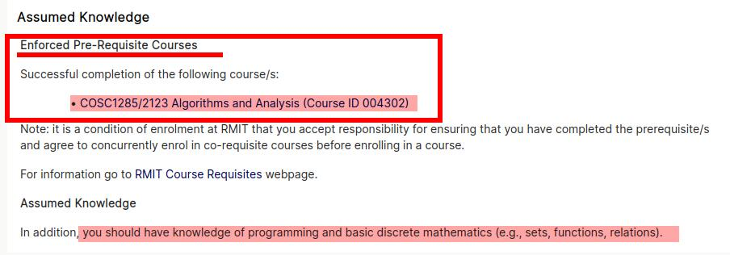
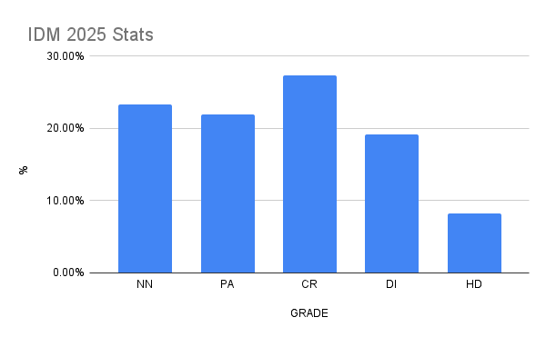

# Course FAQ - Intelligent Decision Making 2026

As any FAQ page, this page is always "under construction”. As we realize that some questions become common, we add them here…

- [Course FAQ - Intelligent Decision Making 2026](#course-faq---intelligent-decision-making-2026)
- [WHY THIS FAQ?](#why-this-faq)
  - [I have a question about the course, but it is not here](#i-have-a-question-about-the-course-but-it-is-not-here)
- [THE IDM COURSE](#the-idm-course)
  - [What is this course about? What is it NOT about?](#what-is-this-course-about-what-is-it-not-about)
  - [What are the pre-reqs for AI?](#what-are-the-pre-reqs-for-ai)
  - [I have not taken A\&A. Can I take the IDM course without the pre-req?](#i-have-not-taken-aa-can-i-take-the-idm-course-without-the-pre-req)
  - [Is there any mentoring program for this course?](#is-there-any-mentoring-program-for-this-course)
  - [What did other student who took the course say about it?](#what-did-other-student-who-took-the-course-say-about-it)
- [COMMUNICATION AND ATTENDANCE](#communication-and-attendance)
  - [Communication policy: I have a question, can I email you?](#communication-policy-i-have-a-question-can-i-email-you)
  - [I want to discuss something face-to-face, can I?](#i-want-to-discuss-something-face-to-face-can-i)
  - [Attendance: do I need to attend workshops?](#attendance-do-i-need-to-attend-workshops)
  - [I work outside and have other commitments, should I take this course?](#i-work-outside-and-have-other-commitments-should-i-take-this-course)
  - [Can I attend in-person workshops remotely?](#can-i-attend-in-person-workshops-remotely)
  - [Will there be workshops recordings?](#will-there-be-workshops-recordings)
  - [What are the dates for this semester?](#what-are-the-dates-for-this-semester)
  - [I am enrolled in COSC2973 (UGRD) but my Canvas says COSC2780 (PGRD). Is everything OK?](#i-am-enrolled-in-cosc2973-ugrd-but-my-canvas-says-cosc2780-pgrd-is-everything-ok)
  - [I enrolled late in the course, can you explain me about X, Y, and Z about the course? What should I do now?](#i-enrolled-late-in-the-course-can-you-explain-me-about-x-y-and-z-about-the-course-what-should-i-do-now)
  - [I have a clash with other courses, what should do?](#i-have-a-clash-with-other-courses-what-should-do)
- [COURSE GENERAL](#course-general)
  - [Is this course theoretical or practical?](#is-this-course-theoretical-or-practical)
  - [What programming languages are used?](#what-programming-languages-are-used)
  - [Are assignments individual or in groups?](#are-assignments-individual-or-in-groups)
  - [What is the overall difficulty of the topics?](#what-is-the-overall-difficulty-of-the-topics)
  - [What is the relation of this course with COSC1125/1127 Artificial Intelligence Course?](#what-is-the-relation-of-this-course-with-cosc11251127-artificial-intelligence-course)
- [DISCUSSION FORUM \& FORUM ETIQUETTE](#discussion-forum--forum-etiquette)
  - [What is the Forum FAQ \& Forum Etiquette?](#what-is-the-forum-faq--forum-etiquette)
  - [Why do you use many platforms (EdStem, Canvas, GitHub, email, GH Classroom, Google, etc.) instead of just Canvas as other courses?](#why-do-you-use-many-platforms-edstem-canvas-github-email-gh-classroom-google-etc-instead-of-just-canvas-as-other-courses)
- [WORKSHOP](#workshop)
  - [Are attendance to the workshop mandatory?](#are-attendance-to-the-workshop-mandatory)
  - [But I cannot book my sessions, it says it is full; should I do?](#but-i-cannot-book-my-sessions-it-says-it-is-full-should-i-do)
  - [When are lecture slides made available?](#when-are-lecture-slides-made-available)
  - [When are lecture/workshop recordings available?](#when-are-lectureworkshop-recordings-available)
  - [So, when \& where are the workshops?](#so-when--where-are-the-workshops)
  - [I cannot attend my workshop session, can I change to another session?](#i-cannot-attend-my-workshop-session-can-i-change-to-another-session)
  - [Should I bring my laptop to the workshops?](#should-i-bring-my-laptop-to-the-workshops)
- [ASSESSMENTS](#assessments)
  - [I was never asked these questions](#i-was-never-asked-these-questions)
  - [Can I ask questions on an assignment/assessment in the forum?](#can-i-ask-questions-on-an-assignmentassessment-in-the-forum)
  - [Are assessments individual or team-based?](#are-assessments-individual-or-team-based)
  - [Can I do the assessments without going to class?](#can-i-do-the-assessments-without-going-to-class)
  - [Academic Integrity? What is that?](#academic-integrity-what-is-that)
  - [In a code assignment/project, how do I make sure I do not go against academic integrity?](#in-a-code-assignmentproject-how-do-i-make-sure-i-do-not-go-against-academic-integrity)
  - [I am very busy with other commitments (work, other subjects, travel, etc.) and may not be able to make the deadline, can I get a 2-3 day extension?](#i-am-very-busy-with-other-commitments-work-other-subjects-travel-etc-and-may-not-be-able-to-make-the-deadline-can-i-get-a-2-3-day-extension)
  - [Can I submit late? What is the penalty?](#can-i-submit-late-what-is-the-penalty)
  - [What is the policy on Special Consideration (SPC)?](#what-is-the-policy-on-special-consideration-spc)
  - [I have a SPC for a project, how does it work?](#i-have-a-spc-for-a-project-how-does-it-work)
  - [I submitted wrongly (e.g., didn't tag correctly) and is now after the due date, can you consider my submission?](#i-submitted-wrongly-eg-didnt-tag-correctly-and-is-now-after-the-due-date-can-you-consider-my-submission)
  - [What are good tips for presentations (in-person or videos)?](#what-are-good-tips-for-presentations-in-person-or-videos)
  - [I would like to challenge the final assessment (review period after grade release); can I do it?](#i-would-like-to-challenge-the-final-assessment-review-period-after-grade-release-can-i-do-it)
- [EXTRAS](#extras)
  - [Cannot access the Google Form, says I need permission](#cannot-access-the-google-form-says-i-need-permission)
  - [Questions about GIT?](#questions-about-git)
  - [Course Survey Experience: what? why?](#course-survey-experience-what-why)
  - [Can I know what other students though about IDM and the teacher?](#can-i-know-what-other-students-though-about-idm-and-the-teacher)
    - [Some links on the topic of student course survey](#some-links-on-the-topic-of-student-course-survey)

# WHY THIS FAQ?

This question is already answered in the [FAQ](FAQ-COURSE.md). 😉

If, somehow, you managed to get out of the [self-reference](https://en.wikipedia.org/wiki/Self-reference), then this is the list of usual questions that are asked about the course. A FAQ like this can help you find the answer right away. There are also many questions that can shed some light on the rationale of certain policies or approaches to the course. Also, by having an FAQ I am able to provide consistent and uniform answers to everyone. Of course, if you cannot find your question here, then you are invited to post it in the discussion forum. As questions become more common or usual, I add them to this list. So, maybe your new question can make it to the list! 😄

## I have a question about the course, but it is not here

If you have any questions about the course that you think other fellow students may be also interested in learning, please post it in the forum!

# THE IDM COURSE

## What is this course about? What is it NOT about?

This is an advanced course on complex decision making via AI techniques and tools. In this 2026 edition, the course will focus on decision making on combinatorial problems, like timetabling, scheduling, planning, etc.

This course has little if any AI Machine Learning, and has a lot of symblic AI (number theory, sets, logic). 😉

An important aspect of the course is the use of **AI declarative techniques and tools**. While we will use Python for the app interface, if needed, the bulk of the learning and work will be done with declarative programming tools. The aim is to develop another way of thinking 🤔 and solving problems 🔨.

IDM a **depth-oriented course**, rather than breath-oriented like AI. This means we try to get deep into the technical content, and try to understand and manage very subtle aspects.

Finally, the course if **seminar and research style**, which means that we deal with research-level techniques and tools. Thus, such techniques and tools will not be fully documented or consistent, and not many people would know about it: it is bleeding edge material... 🩸

## What are the pre-reqs for AI?

Being a last year Bachelor of CS course, this course basically relies on 3 components: _analysis of algorithms and datastructures_, _discrete mathematics_, and _advanced programming_.

To achieve this, the course has [COSC1285/2123 Algorithms & Analysis][AA](A&A) as a MUST ENFORCED pre-requisite:

In turn, to take (and pass) A&A, one needs to complete an advanced (second or third course) programming course and a course in discrete mathematics. 

> [!NOTE]
> For Bachelor in CS, for which AI is core course, the pre-reqs are already built-in in the program structure.

When you take the course as an option/elective (i.e., it is not core in your program), you need to plan ahead and make sure that "you ensure you have completed the pre-requisites" as stated above in the program guide. The alternative is to ask for an exception waiver of the pre-req by providing evidence that you have taken (and passed) an equivalent course elsewhere. Please contact your Program Manager to understand who to submit that request.

## I have not taken A&A. Can I take the IDM course without the pre-req?

**No.** ❗ See question above. As the program guide states, you are to plan ahead and meet the pre-reqs, they are there for a reason of course. Note enforced pre-reqs cannot be replaced by "personal statements": they are there for a reason. Taking a course without the pre-reqs not only jeopardize your situation, but it also imposes additional burden to teaching staff and hence has an negative impact on others in the class.

>[!TIP]
> Sometimes the student has not the exact pre-reqs, but can request a waiver by providing evidence of equivalency. For example, a similar course done in another uni. Please come and talk to me if you think you may be eligible for a pre-req waiver.

## Is there any mentoring program for this course?

Not for this course. Mentor programs are designed for initial courses at uni, not for advanced courses like this one. Also note that the material is very "researchy", so there are not many people who can provide support on its content. 🫨

## What did other student who took the course say about it?

Check [this question](#can-i-know-what-other-students-though-about-idm-and-the-teacher).

# COMMUNICATION AND ATTENDANCE

## Communication policy: I have a question, can I email you?

**Communication/email policy:** Except for personal issues, all electronic communication must be directed to the [EdStem Discussion Forum](https://edstem.org/au/courses/29085/discussion). I only use email for limited communications regarding **personal circumstances** (in which case email is just used to arrange a face-to-face meeting). In particular, I will not respond by e-mail to any requests to clarify lecture, tutorial, or assignment questions. Please use workshops first, and discussion forum second, for all such questions so that a _fair course is run_ and all other fellow students can benefit as well. 

For this course, the forum will be mostly restricted to **announcements** and **clarifications**; teaching will not provide extensive technical support in the forum (as we do with other courses like Math or AI); as this is a in-person Master-level AQF9 course with 3hrs of interactive workshop. Only reasonable questions that couldn't be addressed in the workshop will be answered by the teaching staff. While  we encourage students to participate and contribute among themselves, they should not assume the forum would serve as a full or partial replacement of in-person workshops.

Check [Course Communication Policy here][COM_POLICY]

## I want to discuss something face-to-face, can I?

**Of course!** I am happy to talk to you face-to-face and without a keyboard in the middle! Workshops are the best place for this course, I am there 3+ hours. If you need more privacy (e.g., discuss personal matters), then please send me an email and we will arrange an appointment in my office, no problem!

However, if what you are after is technical support with the course, then you should use the plenty of support already available in workshop sessions, that is exactly where we have tutors ready to help in a one-to-one fashion. Go and ask your question there, **help us to help you!** Of course, simple question and clarifications can also be asked in the course forum! So plenty of opportunities to get help. 

## Attendance: do I need to attend workshops?

**YES!** This is a _research-oriented seminar-style_ advanced course, which means it requires on campus attendance to workshops. This is already specified in the [Course Overview][  VIEW]:

> This course expects students in-person attendance to the whole weekly workshop. Assessments will be carried out during those sessions.

Being a seminar-style course, students are expected to prepare for and actively participate in-person in class via discussions, presentations, and exercises (worth 20%+10% marks overall). Thus, while a minimum attendance standard is not compulsory, non-attendance may seriously jeopardise participation marks.

Workshops are not lectures where the instructor delivers the content. Instead, we discuss together each week content at workshops, we do presentations, execute drills, etc. So, on campus personal presence is necessary. Also, a component of the assessment is assigned to _participation_ during workshops, presentation, and leadership. To participate actively will surely require being there. :-)

In addition, workshops will be the place to discuss your projects/assignments and doubts about them. The course will have a small set of students, which makes it a perfect environment for participation and sharing of knowledge, ideas, and opinions!  So, we strongly suggest attending ALL workshops in person. The discussions, exchanges, and support opportunities done in the workshop will not be duplicated elsewhere.

Note that there is only 1 workshop session of 3hrs, and late in the day. 🕣

> [!IMPORTANT]
> Note that, from 2023, RMIT is committed to _in-person teaching on campus_. So, the course will NOT run online or in hybrid mode anymore, as it did in previous years due to COVID. This means that you should _not_ expect that what happens face-to-face (in-person) will have an "online replacement" (be online streaming, recording, replacement sessions, etc.) This does not mean there will be no online presence, sure there will be (e.g., forum, GitHub), but as additional and complementary resources, not as replacements or interchange.

## I work outside and have other commitments, should I take this course?

If you cannot make it to the workshops, then we recommend you look for an alternative course that you can attend or take without (much) attendance. A major distinctive feature of this course is the in-person work during the 3hrs weekly workshop, and the contributions and work in each workshop do count towards your participation marks, and it is where the learning is supported.

## Can I attend in-person workshops remotely?

No. RMIT is committed to on-campus experience and there is no hybrid teaching for this course. In any case, given the interactive nature of this course, this wouldn't make any sense for this particular course.

Please refer to [this question](#attendance-do-i-need-to-attend-workshops).

## Will there be workshops recordings?

No. All will be in-person and highly interactive. It wouldn't make any sense anyways, but since students will drive the sessions we wouldn't record them even if for privacy and non-exposure reasons. In addition, it is super important that we provide the best setting for students to participate without any barrier. Recording not only has privacy issues, but is also a deterrent for many students to ask or participate (e.g., for fear of being recorded asking or saying something wrong, etc.)

## What are the dates for this semester?

Here is the [Academic Calendar for 2026](https://www.rmit.edu.au/students/my-course/important-dates/2026/he).

## I am enrolled in COSC2973 (UGRD) but my Canvas says COSC2780 (PGRD). Is everything OK?

Yes, no need to worry. This is just a Canvas "hack" for cross-listed courses. We maintain only one site (COSC2780's one), but everybody in the course can access it. No problem, come and enjoy! ;-)

## I enrolled late in the course, can you explain me about X, Y, and Z about the course? What should I do now?

First of all, I assume you have discussed your late enrollment with your Program Manager. This is important. We assume students have been diligent beforehand and are fully ready and enrolled at least in Week 0, if not before.

Enrolling late means that you have lost content and information about the course, and possibly assessments. This is fine as long as you **got the OK of your Program Manager** and you take **full responsibility** of your late entering to the course, _without shifting the burden to the teaching staff_.

Think about it: joining a course in week 2 or 3 is like getting 15' late to a meeting with lots of people: you do it with care, trying not to bother others, and assuming _full responsibility_ for having arrived "late". Would you stop the meeting and ask: _"can you please tell me what you have been discussing so far?"_ Surely not... ;-)

So this means that:

1. The teaching staff will not go over the course logistics and information on a per-student basis when the student has joined the course late (and lost the first week of information and course overview).
   - This means you would have to gather the information provided in the first weeks by yourself, by reading the online course pages/information, parsing all relevant forum posts, watching the videos and recordings. You would probably benefit from talking to other fellow students who are in sync with the course.
   - Please, do not ask the teaching staff to go over the course details _again_, but if you have to, please do it _after_ you have processed everything and do it _in person_ in lectorials, tutorials, consultation time. This would show that you really care and put a legitimate effort to catch-up (and hence the teaching staff will be more sympathetic). :-)
2. You will have to catch-up with the technical content of the course.  This is an intense course and there is significant reading allocated to each week, starting from week 1 itself. This means you would have to put significant effort to sync with the course.
   - Entering in week 2+ should be doable with effort; after that would be very challenging and risk.
3. You are not entitled to any extension or re-do of assessments run or distributed already when you enrolled.

In summary, the course is very intense, even for those starting on time, and every week matters. I am OK if you join late after discussing with your PM, as long as you **take full responsibility** of such late start. Of course I am also OK with students contacting me before formally enrolled and while they are waiting for administrative process to conclude; this will allow students to stay in sync with the course until all paper-work is sorted out.

Hope this is clear and all the best in the course!

## I have a clash with other courses, what should do?

I do not manage that aspect, please refer to the timetabling FAQ: <https://www.rmit.edu.au/students/my-course/class-timetables/faqs>

The most relevant question is this:  _I have two classes that clash. What can I do?_

For higher education students:

> Class times are selected to ensure core course options are clash-free, but it’s not possible to cater for every elective option or non-standard enrolment, for example when taking courses from different year levels from your program. If you have an unavoidable tutorial, workshop, or lab clash, you should discuss your enrolment with your School or your Program Coordinator.

In this context, “Program Coordinator” = Program Manager

# COURSE GENERAL

## Is this course theoretical or practical?

**Both!** I would say that it is ~70% practical and ~30% theoretical. There will be significant programming, but not in classical "mainstream" programming languages like Java or Python. Instead, you will learn to do constraint programming in declarative logic and constraint-based programming languages. These languages build on top of theoretical notions and frameworks, like _logic_ and _set theory_. Thus, we will talk about formulas, constraints, variables, models, satisfiability, etc.

## What programming languages are used?

It depends on the edition. For 2024 we will use [SWI-Prolog](https://www.swi-prolog.org/) and [Clingo](https://potassco.org/clingo/) Answer Set Programming. We will also use Python.

Note that you are not meant to know these non-standard languages: it is one of the aims of the course that you learn them! 👷🏽

## Are assignments individual or in groups?

A mix. There will be individual components as well as group assessment components. The first project is individual; the second is group-based but also has individual components in it. The specification will provide all details.

## What is the overall difficulty of the topics?

One could argue that the course is more towards the challenging/difficult spectrum because:

1. It is an _advanced course_, expected to be taken by postgraduate students and last year (good) undergraduate students.
2. It deals with _abstract mathematical concepts_, like logical models and formulas, recursion and self-reference, complex and infinite objects.
3. It requires _problem solving skills_ to solve combinatorial decision making problems.
4. It requires _self-driven attitude_: there is significant pre-reading before workshops. It is not a classical undergraduate course where the instructors yields all the knowledge during the session.
5. It is run by a _demanding teacher_ who pushes students hard. 🫷

Said so, "difficult" is very personal and depends a lot on the background, motivation, and dedication of each student.

One initial test is to read Part I.1 and I.2 (Sets & Logic) in the Book of Proofs:

<https://www.people.vcu.edu/~rhammack/BookOfProof/>

and see how it goes. If you don't feel comfortable with that, then this may be a signal 📶

Another objective reference of difficulty could be the grade distribution. In general, the course has had ~10% HDs and ~25% NN. So, it is hard to get an HD and if one doesn't do the work to a good standard it is easy to fail it. 🤷 These were the results for 2025 edition:

So, in general, if you are looking for a course to that is not too demanding (maybe because you are already taking difficult courses in the semester), then _this may not be a good choice_. However, if you have motivation and time space to dedicate, I suspect you may learn a way of thinking and solving programs that you have never been exposed to before.

Nonetheless, you are happy to come to chat with me and we can discuss your _own case_. Please drop by my office or send me an email for an appointment; I am usually in my office available on Mondays, Wednesdays and Fridays. Come!

Remember you can also check what other student said about the course, refer to [this question](#can-i-know-what-other-students-though-about-idm-and-the-teacher).

## What is the relation of this course with COSC1125/1127 Artificial Intelligence Course?

Basically this is one sub-topic of the AI course expanded into a whole course. Thus we go much much deeper. This means that if you had taken (and passed!) AI before, then you will probably understand many things much faster. The natural progression is AI (general course) --> IDM.

# DISCUSSION FORUM & FORUM ETIQUETTE

## What is the Forum FAQ & Forum Etiquette?

It is a set of questions and guidelines how to use and behave in the forum professionally. Please see dedicated [Forum FAQ & Etiquette][FORUM-FAQ].

## Why do you use many platforms (EdStem, Canvas, GitHub, email, GH Classroom, Google, etc.) instead of just Canvas as other courses?

This is a valid question that some student have, as they see themselves learning a few new platforms for the course.

>[!IMPORTANT]
> For many years I had to explain to some students (the wide majority understood right away), why I was using EdStem rather than Canvas. Not anymore. As of 2026, the School of Computing Technologies adopted EdStem formally, recognising its superiority over Canvas. As many other courses keep switching to EdStem, it became obvious. So, I am not anymore an outlier... 👏

First, be assured that the use of several platforms and tools is not random: _there is a rationale with significant thought, experience, and work behind_.

In general, for this course we are mostly using EdStem and GitHub alone, that's all, with occasionally 2-4 emails for details on the results (~1 email per project). That does not seem to be an overload for uni-level.

More broadly, I am on the opinion that it is actually _not_ so good for the student learning to prioritize "uniformity" due to (at least) two reasons:

1. First, it is just **impossible and unrealistic in Computer Science**: there are lots of technologies and systems around that are all useful in their own way and that different people use, be Github, Slack, Canvas, Latex, email, Discord, Edstem, Travis, Jira, stack-overflow, Menti, etc.
   - A good CS practicioner should not only be versed on many of them, but also flexible adaptive enough to learn and manage new ones as they are needed or requested (e.g., at work or on an open-source project).
   - As a student itself put it in a feedback: _"I like the fact that our submission is done through GitHub as it provides some industrial sample."_
2. As an educator, I _personally_ **don't believe in a "McDonald"-type uniform approach to education and learning**, under which everything is in the same place, color, format, size, and taste 😆.
   - While uniformity may provide a sense of "safety" to students, it does not train them to be _flexible_ and _adaptive_. It also does not recognise that there are indeed different teachers and different styles of teaching, like in the real world.
   - So, I do think it is beneficial for students to be exposed to different style of teachers and teaching styles, so they can learn many ways, not just "one way". 😃

Now, the above **does _not_ mean that one can use many different things/tools/platform just for the sake of making things non-uniform!** There must be a technical reason behind! The point is that _if_ there is a tool X that solves problem A better, then fine, let's use X and accept that not everything comes in the same way.

Note that **sometimes a student may not _directly_ understand** in which sense an option is "better", but here is where we expect students to trust the expertise and experience of the teacher, as much as one trusts a pilot when boarding a plane!

- For example, a student may not understand why we don't use Canvas discussion forum and the fact that forums like EdStem and Piazza not only increases engagement a lot (between 7x to 10x), but also are much much more productive for the teaching staff, which in turn allows staff to answer way many more questions and quicker, thus providing better service for more students.

Finally, I note that this is **MY approach/view/perspective to Computer Science and Education** at uni level, this part of my "teaching style".  I accept others have a different view and see more benefits in prioritizing uniformity above everything else.

I hope this shed some light on the issue, and of course if a student has a better way/tool to do something within the course, **I am always open to constructive suggestions** and I will, without hesitation, adopt them if they are provably better and accessible.

# WORKSHOP

## Are attendance to the workshop mandatory?

Yes! This is a seminar-style course and thus requires on campus attendance; check [this question](#attendance-do-i-need-to-attend-workshops).

## But I cannot book my sessions, it says it is full; should I do?

There is only one session for this course of 3hrs, just come... 👌

## When are lecture slides made available?

There are no lectures in this course. Face-to-face sessions are interactive workshops where we will all be discussing the topic of the week.

## When are lecture/workshop recordings available?

Being an interactive student-driven workshop, there is no recordings for the sessions. As stated in [this question](#attendance-do-i-need-to-attend-workshops), attendance is expected to every workshop (only once per week). Also see [this question on recordings](#will-there-be-workshops-recordings).

In any case, there is no classical “lecture” delivered by the instructor as in other courses, and we do not record student presentations or engagement, as they are assessment and not material for release in the "wild". We also want to put zero obstacles for students to participate, without any fear.

## So, when & where are the workshops?

They will be carried out on Tuesdays 5:30pm - 8:30pm in room 012.10.006.

## I cannot attend my workshop session, can I change to another session?

There is only one workshop session for this small course. If you are taking this course, please make sure you are available at workshops, that is indeed “the core of the course”.

## Should I bring my laptop to the workshops?

**Definitively!** Yes, please make sure you bring your laptop 💻, the course will run in BOYD (bring your own device) mode. We will be doing practical hands-on work in workshops, so it is important you are able to execute them.

# ASSESSMENTS

## I was never asked these questions

This is correct and one of the objectives of the course’ assessments. This is an advanced, Master-level, course and hence we assess at the highest level of the [Bloom Hierarchy](https://cft.vanderbilt.edu/guides-sub-pages/blooms-taxonomy/) (_evaluate, create_) so as to achieve higher-order levels of learning for applying and creating new solutions.

At this level, one important skill---a very important one---is to be able to handle new problems and challenges with the knowledge & problem-solving strategies you gathered earlier and to demonstrate autonomy and self-driven process. It is not enough to _just_ solve questions that you have seen before. In particular, if you want to excel, you must be able to welcome & handle novel challenges.

## Can I ask questions on an assignment/assessment in the forum?

Of course, but please check the document _"[Posting about assessments](https://docs.google.com/document/d/1HdrY91LIPRZOEni_jsCwmN8Oc8MrUzljen6qHzbtQeU/edit#heading=h.nj8m4hp7jeo2)"_ to make sure you are doing it in the appropriate way.

Note that in this course we expect the bulk of interaction to happen in workshops. We will not be enganging in the forum as we do in AI or MATH. This course is all about being and working in the workshops. The forum will mostly be used for announcements and clarification issues. See [this question](#communication-policy-i-have-a-question-can-i-email-you).

## Are assessments individual or team-based?

Both. There will be individual component assessment components (participation, presentation, assignment project 1) as well as a team-based assessment (course project).

## Can I do the assessments without going to class?

Some yes, but some not. You will certainly work outside class on your Programming assignments and projects, though there will also be time during workshops to work on them and get support from the teacher.

However other assessments in the course will require being in-person, such as preparation/participation quizzes, participation in discussions, presentations, and workshop exercises. These will also be available to students participating in-person in the class. Please refer to the [Attendance: do I need to attend workshops?](#attendance-do-i-need-to-attend-workshops) question.

## Academic Integrity? What is that?

Since this is an advanced course, we assume students are very knowledgeable about academic integrity and that nobody in the course will engage in dishonest behaviour in any form or shape.

Refer to [ACADEMIC-INTEGRITY](ACADEMIC_INTEGRITY.md)_.

## In a code assignment/project, how do I make sure I do not go against academic integrity?

Good one! This deserves its own separate answer [here](CODE-INTEGRITY.md).

## I am very busy with other commitments (work, other subjects, travel, etc.) and may not be able to make the deadline, can I get a 2-3 day extension?

We have 150+ students and therefore lots of students could claim time constraints for multiple reasons. Besides the unmanageable workload that this would imply (reviewing and tracking each case, marking them at different times, different releases, etc.), I am _not able/allowed to arbitrarily judge_ which cases are OK and which ones are not: I would undoubtedly be making mistakes and hence treating students differently, _which can put me in a very risky situation due to fairness issues_.

So, extensions are reserved to _extreme cases that are totally outside the control of the student_, such as health issues.

We expect students enrolled in the course to _have arranged all their other commitments_ (e.g., work, courses, family, trips, etc.) beforehand to make sure they can carry out the course _under the planned schedule_.

Also, we note that the difficulty of each assessment has been planned to be achievable within the time-frame, so claims about the difficulty of the task will not be entertained wrt extensions. Pushing one deadline for many students will not only complicate the execution of the course, but will put students in a more difficult situation for upcoming (more demanding) assessments.

## Can I submit late? What is the penalty?

Yes, for assignment projects only (not timed and timetabled assessments), you can submit late with, albeit with a penalty. Assignment projects received late and without prior extension approval or special consideration will be penalised by a deduction of 10% of the total score possible per calendar day late for that assessment.

Please note that late submissions are only allowed to assignments and projects, not for timed and timetabled assessments (e.g., in class quizzes, challenge exercises, or take-home exercises). These must be done during the time-frame allowed and no late submission is permitted.

## What is the policy on Special Consideration (SPC)?

The dates of all assessments in this course are given well in advance. Plan early your work around your commitments and workload, start on the assessments early, and submit them substantially before the deadline, preferably at least one or two days before. Submitting close to the deadline could be risky and you may fail to submit on time, for example due to loss of Internet, laptop problems, server delays, heavy workload, late enrolment, external commitments, etc

However, if you know you will be unable to complete an assignment due to illness or personal circumstances outside of your control, please contact your lecturer immediately for special consideration. Evidence will be required. In many cases, though, I cannot grant unilateral special considerations and you may need to go through RMIT formal process for [Special Consideration (SPC)][SPC].

Each request will be considered on an individual basis. If the request is approved, the deadline for the assignment will be extended. If the request is denied and the assessment missed, you will unfortunately receive a 0 for that assessment.

Please note that while no SPC will be granted frivolously, any request received close to the assessment date (or after the date!) will generally not be accepted except in the most extreme circumstances. This is to encourage students to plan days and weeks ahead, and to discourage last minute pleas for help.

> [!WARNING]
> Finally, because of the nature of assessments, including their complexity and quick release of results/feedback, any SPC more than a few days will be handled the form of an **Equivalent Assessment**, that is, another _ assessment later on that will assess the same content but possibly in a different way. In most cases this will involve a pre-arranged in-person 1-2hrs closed-book assessment with the instructor (e.g., a set of exercises to complete) evaluating the same content as the original assessment.

## I have a SPC for a project, how does it work?

It depends. If the SPC provides a short extension (less than a week), then you will just need to submit under the new (extended) deadline.

If however the SPC cannot be granted under a short extension, then the assessment will be carried out as an _Equivalent Assessment_. An Equivalent Assessment covers the same content and at the same expectations, but can be done in a different format. In most cases, an Equivalent Assessment will involve solving a set of precise exercises on paper with the instructor on campus. The instructor will set the date/time and location and the student must make sure they are made themselves available for it.

## I submitted wrongly (e.g., didn't tag correctly) and is now after the due date, can you consider my submission?

We will not fix any submission and it is your responsibility to do it correctly.

However, the nice thing about git-based projects/assessments is that we can rely on commits. So, if you have submitted your tag incorrectly (did not tag it at all, tagged with different name or different capital letters), then please fix your submission by tagging the specific commit you want me to (re)mark and let us know you did so in the corresponding PR of your repo (no email, no forum).

Note we will of course use the timestamp of the commit itself, not of when it was tagged. This means that if the commit was done before the deadline, then all good!! Isn't this cool?

## What are good tips for presentations (in-person or videos)?

The course offers students the possibility to present to an audience technical material, which is indeed a necessary skill of any professional. The presentation offered will help the student develop their skills and knowledge on how to present, and also expose them to its challenges.

Some shortcoming that we have seen over the editions and that you may want to pay attention are:

- Slide decks very lazily put together.
  - e.g. couple of dot points, lots of space devoted to superfluous graphics and stock photos that presumably come from a template, formatting errors, pixelated screenshots, no numbering, etc.
- Poor design of slides
  - too small/large fonts, overcrowded material, too little material, jumpy organisation, no connections.
- Poor or no projection of voice: Speak up! 🔈
- Poor or no eye contact with audience. 👁️
- No introduction to presentation: who and what.
- Significant time devoted to irrelevant topics.
- Hands on pocket.
- Speaker seems bored and not interested (imagine the audience then!). 😫
- Uncritical use of LLMs 🦙
- No or very shallow and static examples.
- Read directly from the slides or notes. 👓
- Speaker doesn't understand what is reading. 😕
- No stepping through the examples, just talking over them. 👣
- Monotone delivery. Speaker looked disengaged or bored. Watch about **cadence** [HERE](https://www.facebook.com/share/v/15QbjDBweS/), [HERE](https://www.youtube.com/watch?v=VY0r0WV0GAQ), and [HERE](https://www.youtube.com/shorts/uC11-9DfTnA).
- Too many **"filler words"**; watch about that [HERE](https://www.youtube.com/shorts/ApPfimH7_tk), [HERE](https://www.youtube.com/shorts/DPIfMnW4aAQ) and [HERE](https://www.youtube.com/watch?v=hUY8DiQgUUg).

> [!TIP]
> Probably the best advice is: **rehearse your presentation as many times as needed**. This could mean 5, 10 or 20 times, yes. Could be done in front of a mirror. Maybe you can even record yourself, so you can recognise places to improve. You will notice already how much you improved when you practice is seriously three to five times: your presentation comes more natural.

## I would like to challenge the final assessment (review period after grade release); can I do it?

Of course! If you believe there has been a **factual error in the marking** of your final assessment, you may request a review. However, please follow these important guidelines when preparing your request:

- **Focus only on concrete, objective issues** — for example, parts of your answer that were not considered, correct answers that were marked as incorrect, or incorrect tallying of marks.
- **Do not include subjective opinions** — such as how many marks you believe you "deserve" or whether you feel your answer should have received more credit. These will not be considered.
- **Be precise and specific**: indicate the exact question, the part of your answer in question, and clearly explain the marking issue.
- Always **provide supporting evidence** — for example, cite the relevant lecture content, textbook, or marking guide to justify your claim.

Requests that are vague, emotional, or speculative will not be reviewed.

Please send your review request in by filling and emailing the  **Review of Assessment Results** form within the allowed timeframe. The review will focus **strictly on the factual marking accuracy**, not on re-evaluating academic judgement or partial credit.

> [!IMPORTANT]
> When a review is performed upon request, the final mark can go up, stay the same, or go down.

# EXTRAS

## Cannot access the Google Form, says I need permission

If you see something like this:

then chances are you are not correctly logged into your RMIT account or you are logged with your private Google account and your browser cannot distinguish. Either open it an incognito browser window or make sure you are logged into your RMIT account. There is nothing I can do from my side if you don’t access the form with the right authentication credentials.

## Questions about GIT?

We have a dedicated [GIT FAQ](FAQ-GIT.md) for you.. :-)

## Course Survey Experience: what? why?

The **usefulness of student course surveys** has been the subject of **considerable debate in academia**. There is ongoing discussion about whether surveys genuinely help improve teaching quality or whether they may unintentionally encourage **lower academic standards** or **grade inflation**, thus ultimately hurting the students. If you would like to explore this debate further, I have included several articles at the end of this section.

Regardless of these discussions, one fact is clear: **the Course Survey is used by universities to evaluate academic staff and their teaching**. It is often the main formal source of teaching evaluation. The survey ultimately produces a *Good Teaching Score (GTS)* ranging from **1 (poor)** to **5 (excellent)**. Across RMIT, the **average score is typically around 4.10**. 😯

Each survey question is rated from **1 (strongly disagree)** to **5 (strongly agree)**. Importantly, **only scores of 4 and 5 are counted as positive feedback** in institutional reporting. Because the average score is already above 4, giving a score of 4 or lower effectively signals *around-average or below-average performance* in comparative evaluations. 🫢

## Can I know what other students though about IDM and the teacher?

Yes! Regardless of how universities ultimately use student feedback, in my view **the best use of student feedback is for students themselves**.

Knowing what previous students experienced helps prospective students set realistic expectations, prepare appropriately, and approach the course with the right mindset. In simple terms:

- *Would you recommend this course to a friend?*  
- *Would you recommend the lecturer?*

While survey results are not always shared widely with students, **I personally make my previous course results available** so you can see how earlier cohorts perceived the course and teaching.  

👉 [Here are the results for this course](FAQ-REVIEWS.md).

In particular, **I value feedback from students who actively engaged with the course** — attending lectures, participating in tutorials, and using the course resources. I am interested in understanding:

- what worked well and supported your learning (so it can be maintained or strengthened), and  
- where improvements or changes could make the course better for future students.

👍 Constructive positive/negative feedback helps improve the course in meaningful ways.

😄 **Your contribution is genuinely valuable for future students — please help them by sharing your experience!** 😄

### Some links on the topic of student course survey

**Want to know more?** 

There has been extensive and interesting debate about whether course surveys achieve their intended goals, or whether they sometimes backfire by encouraging easier courses aimed at avoiding negative feedback, potentially contributing to grade inflation and weaker learning outcomes.

The article *[Student Course Evaluations Get An “F”](http://tinyurl.com/nxsmyc4)* reports findings suggesting that:

> The better professors were — measured by how well students performed in later courses — the lower their student ratings tended to be.

In other words, courses that challenge students and support long-term learning may not always feel immediately rewarding, even if they ultimately benefit students academically. Interestingly, studies also suggest that highly prepared students tend to value demanding teaching more positively.

Other articles present evidence suggesting a **weak or even negative correlation between student evaluations and actual learning**:

1. [Zero Correlation Between Evaluations and Learning — New study could be another nail in the coffin for the validity of student evaluations of teaching](http://tinyurl.com/hdd7979)
2. [Students don't know what's best for their own learning](https://theconversation.com/students-dont-know-whats-best-for-their-own-learning-33835)

This raises an important concern: even when surveys are well intentioned, their long-term effects on education may not always align with what best supports student learning and career paths.

More articles on course surveys and grade inflation:

- [‘A’ Is for Average: College Grade Inflation](http://tinyurl.com/h2d88cy)
- [The New Normal: The Problem of Grade Inflation in American Schools](https://drive.google.com/file/d/1Z1vjzcpsA3n0m3_A6NtRYwxMid1afT9b/view?usp=sharing)
- [When A is for Average: the High Cost of Grade Inflation](https://ethics.assets.ets.org/prod/lesson/e4677e43-e928-43d6-bf2d-a3f1259964a5/docs/Resource-When-A-is-for-Average-the-High-Cost-of-Grade-Inflation.pdf) – Tutor Talk

Finally, if you are interested in higher education more broadly — particularly universities in Australia — this ABC *Big Ideas* podcast episode is highly recommended:

- [What students really think of the university](http://tinyurl.com/lrdem76) — *Big Ideas*, ABC Radio National (Australian Broadcasting Corporation)

As a university student and future graduate, understanding how higher education works — including how teaching is evaluated — is part of your academic development. Your university experience should be more than collecting credits or learning predicate logic.

**Be curious. Form your own informed opinion. Enjoy the journey.** 🎆

[FORUM-FAQ]: https://docs.google.com/document/d/1HdrY91LIPRZOEni_jsCwmN8Oc8MrUzljen6qHzbtQeU/edit?usp=sharing
[RMIT-SPC]: http://www.rmit.edu.au/students/specialconsideration
[RMIT-CALENDAR]: https://www.rmit.edu.au/students/my-course/important-dates
[AA]: https://handbook.rmit.edu.au/ords/r/rmit/catalogue/course?p6_code=004302&clear=6
[COM_POLICY]: https://edstem.org/au/courses/29085/lessons/102733/slides/706362
[COURSE_OVERVIEW]: https://handbook.rmit.edu.au/ords/r/rmit/catalogue/class?p8_code=053578&p8_class_guide_course_of_code=COSC2780&p8_class_guide_class_nbr=1457&p8_class_guide_term_descr=Semester%201
[SPC]: http://www.rmit.edu.au/students/specialconsideration